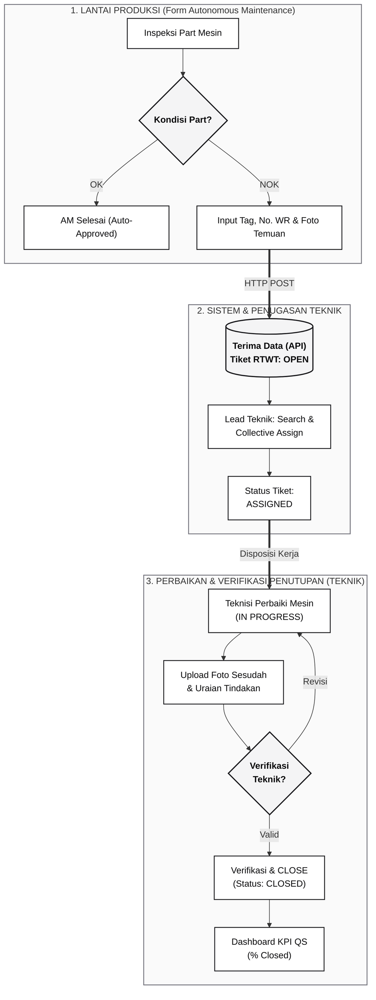

# 📊 Flowchart Integrasi Form AM & RTWT Mesin (Plant Pulogadung)

Diagram alur end-to-end terintegrasi dari saat operator menemukan abnormalitas mesin di Form AM hingga penugasan dan penutupan tiket di sistem RTWT Mesin (Closed-Loop).

---

## 📌 Ringkasan Alur Kunci:
1. **Lantai Produksi (Form AM):** Memicu pembuatan tiket RTWT Mesin saat part bernilai NOK (dilengkapi No. WR & foto temuan).
2. **Collective Assign by Teknik:** Supervisor teknik memfilter kategori masalah mesin lalu menugaskan banyak tiket secara massal (*bulk*) ke teknisi dalam satu aksi.
3. **Syarat Penutupan Mutlak (Closed-Loop):** Tiket HANYA boleh ditutup oleh **Tim Teknik** dengan syarat wajib melampirkan foto sesudah perbaikan dan uraian tindakan korektif.
4. **Pencapaian KPI QS Pulogadung:** Keberhasilan pemeliharaan dinilai dari persentase tiket yang berhasil berstatus **CLOSED**.

