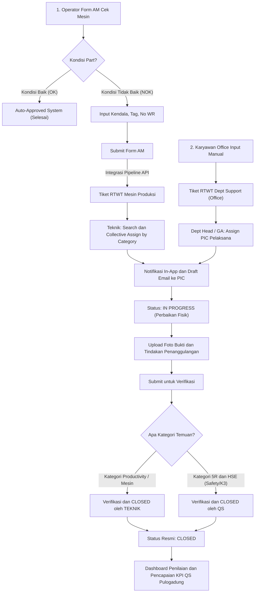

# 📊 Flowchart Integrasi Form AM ke Breakdown Management (RTWT QS Pulogadung)

Diagram alur end-to-end dari saat operator menemukan abnormalitas di Form AM hingga verifikasi dan penutupan tiket di Breakdown Management System (BMS).

---

## 📌 Ringkasan Alur Kunci:
1. **Form AM (Lantai Produksi):** Memicu tiket RTWT ketika part bernilai NOK.
2. **Dua Scope di BMS:** RTWT Mesin (dari Form AM) dan RTWT Dept Support (dari input Office).
3. **Collective Assign by Teknik:** Memfilter kategori temuan mesin lalu menugaskan banyak tiket secara massal ke teknisi.
4. **Otoritas Penutupan (Closer):**
   - Temuan **Productivity / Mesin** diverifikasi & ditutup oleh **TEKNIK**.
   - Temuan **5R & HSE** diverifikasi & ditutup oleh **QS**.
5. **Penilaian QS:** Dihitung dari seluruh tiket yang sudah berstatus **CLOSED**.
