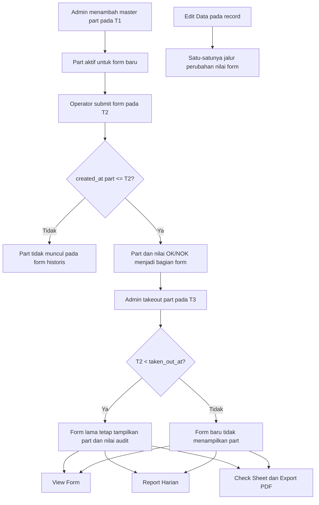

# Alur Audit Master Part dan Export PDF

Aturan ini berlaku untuk halaman View, Report Harian, Check Sheet Periode, dan Export PDF.

## Resolver histori

Sebuah part berlaku pada record hanya jika:

- `master_part.created_at <= form.created_at`; dan
- `master_part.taken_out_at` kosong, atau `master_part.taken_out_at > form.created_at`.

`active_from` tetap dipakai sebagai batas tanggal operasional, tetapi tidak cukup untuk membedakan perubahan pada hari yang sama. Karena itu timestamp `created_at` wajib dipakai agar part yang ditambah siang hari tidak bocor ke form pagi hari.

Export PDF memakai resolver yang sama dengan Report Harian. Tidak boleh mengambil daftar `master_part` aktif saat PDF dibuat.