<mark>Zoho Sign Document ID: 34EDBFD6-QDQHEQQMSF4UJJ2CRLOZWHQEDMS6WQQPS6C7ZDNJXOA</mark> 口bintangtoedjoe 

URS (PRODUCTION - PLG) 

albe Company 

### **_SPESIFIKASI KEBUTUHAN PENGGUNA (SKP) USER REQUIREMENT SPECIFICATION (URS)_** 

### **_AUTONOMOUS MAINTENANCE DI PRODUKSI PULOGADUNG BERBASIS WEBSITE_** 

|**URS No. :**|**Tanggal : 23 Juni 2026**|
|---|---|

###### **LEMBAR PERSETUJUAN DOKUMEN** 

Pra-persetujuan URS ini akan menjadi tanggungjawab bersama dari area fungsional berikut ini. 

|**AREA FUNGSIONAL** **Disusun oleh:**|**NAMA**|**TANDA**|**TANGAN**|**TANGGAL**|
|---|---|---|---|---|
|Production Superintendent Site Pulogadung|Yudha Satria Nugraha|||02 Jul 2026|
|Manufacturing Development Supervisor Site Pulogadung|Kyla Alcia Tambunan|lyda|KAT|03 Jul 2026|
|**Diperiksa dan disetujui oleh:**|||||
|_Robotic & IoT Supervisor_ _(Operational Technology)_|Ferdinand Natanael S|~~a~~|FN5|03 Jul 2026|
|_Quality Assurance Supervisor_ _(Quality Assurance)_|Vany Okky Safitri|Torng|VOS|06 Aug 2026|
|_Operational Technology Manager_|Bharestu Ressy Rafsanzani||ARR|06 Aug 2026|
|_Quality Assurance Manager_|Yudi|H||08 Aug 2026|
|_Engineering Manager_|Krisnadi Agustan||KAN|08 Aug 2026|
|_Business Process Transformation_ _(Production Manager)_|Agung Maryadi ||AMI |09 Aug 2026|
|_Site Division Head Pulogadung_|Michael Wibawa |~~-~~ ~~Mid~~|~~MW~~ |~~A~~ 10 Aug 2026|
|_(Digital Transformation Leader)_ _Quality Operation Division Head_|Agus Triyantoro ||ATO|10 Aug 2026|

###### **RIWAYAT PERUBAHAN DOKUMEN** 

|**REVISI** **00**|**PERUBAHAN** **Dokumen baru**|**DISUSUN OLEH**|**TANGGAL**|
|---|---|---|---|

Lampiran 1 – WI-QO-QO-1007.00 

Dokumen ini telah ditandatangani secara elektronik menggunakan aplikasi FUPD Online dengan melampirkan lembar persetujuan elektronik milik PT. Bintang Toedjoe (A Kalbe Company) 

Halaman : 1/27 

APPROVED 

<mark>Zoho Sign Document ID: 34EDBFD6-QDQHEQQMSF4UJJ2CRLOZWHQEDMS6WQQPS6C7ZDNJXOA</mark> 

URS (PRODUCTION - PLG) 

## bintangtoedjoe A Kalbe Company 

|**DAFTAR ISI**|
|---|
|**DAFTAR ISI........................................................................................................................................................................2**|
|**DAFTAR GAMBAR...........................................................................................................................................................3**|
|**DAFTAR TABEL................................................................................................................................................................3**|
|**A. PENDAHULUAN...........................................................................................................................................................4**|
|**1. Latar Belakang.........................................................................................................................................................4**|
|**2. Tujuan dan Manfaat..................................................................................................................................................5**|
|**B. GAMBARAN UMUM SISTEM.......................................................................................................................................5**|
|**1. Ruang Lingkup.........................................................................................................................................................5**|
|**2. Penerapan terhadap persyaratan GxP.......................................................................................................................6**|
|**3. Flow Process.............................................................................................................................................................6**|
|**C. REQUIREMENTS..........................................................................................................................................................7**|
|**1. Operational Requirements.........................................................................................................................................7**|
|1.1. Functional Requirements.....................................................................................................................................7|
|**2. Technical Requirements...........................................................................................................................................28**|
|2.1 Spesifikasi Server.............................................................................................................................................28|
|**3. Interfaces................................................................................................................................................................29**|
|**4. Non-functional atribut.............................................................................................................................................29**|
|4.1. Business Contingency Plan................................................................................................................................29|
|4.2. Back up, restore................................................................................................................................................29|
|4.3. Server yang digunakan & data store....................................................................................................................30|
|**D. OTHER REQUIREMENTS..........................................................................................................................................30**|
|**1. ALCOA requirement..............................................................................................................................................30**|
|1.1. Attributable.....................................................................................................................................................30|
|1.2. Legible............................................................................................................................................................31|
|1.3. Contemporaneous.............................................................................................................................................31|
|1.4. Original...........................................................................................................................................................31|
|1.5. Accurate..........................................................................................................................................................31|
|**E. GLOSARIUM...............................................................................................................................................................32**|

Lampiran 1 – WI-QO-QO-1007.00 

Dokumen ini telah ditandatangani secara elektronik menggunakan aplikasi FUPD Online dengan melampirkan lembar persetujuan elektronik milik PT. Bintang Toedjoe (A Kalbe Company) APPROVED 

Halaman : 2/27 

<mark>Zoho Sign Document ID: 34EDBFD6-QDQHEQQMSF4UJJ2CRLOZWHQEDMS6WQQPS6C7ZDNJXOA</mark> 

URS (PRODUCTION - PLG) 

## bintangtoedjoe A Kalbe Company 

##### **DAFTAR GAMBAR** 

|Gambar 1. Flowchart Digital Form AM...............................................................................................................6|
|---|
|Gambar 2. Tampilan Register User......................................................................................................................8|
|Gambar 3. Tampilan Login...................................................................................................................................9|
|Gambar 4. Session Expired.................................................................................................................................10|
|Gambar 5. Display Home Page...........................................................................................................................18|
|Gambar 6. Display Home - Mesin (View, Approval, Edit Data, Delete)...........................................................18|
|Gambar 7. View Mesin.......................................................................................................................................19|
|Gambar 8. View Mesin - Export.........................................................................................................................19|
|Gambar 9. View Mesin – Edit Data (Kondisi)...................................................................................................19|
|Gambar 10. View Mesin – Edit Data (Note Perubahan yang Dilakukan)..........................................................19|
|Gambar 11. View Mesin - Approval...................................................................................................................20|
|Gambar 12. Users Display..................................................................................................................................20|
|Gambar 13. View User.......................................................................................................................................21|
|Gambar 14. Edit User.........................................................................................................................................21|
|Gambar 15. Delete User......................................................................................................................................22|
|Gambar 16. Add New User.................................................................................................................................22|
|Gambar 17. Panduan Pengisian AM...................................................................................................................22|
|Gambar 18. View Profile....................................................................................................................................22|
|Gambar 19. View Profile – Account Detail........................................................................................................23|
|Gambar 20. View Profile – Edit Account...........................................................................................................23|
|Gambar 21. View Profile – Change Email.........................................................................................................24|
|Gambar 22. View Profile – Reset Password.......................................................................................................24|
|Gambar 23. Approval List by System.................................................................................................................25|
|Gambar 24. Approval Manual by User...............................................................................................................26|
|Gambar 25. PDF Report Form AM....................................................................................................................27|

##### **DAFTAR TABEL** 

|Tabel 1. Operational Requirements......................................................................................................................7|
|---|
|Tabel 2. Spesifikasi Perangkat............................................................................................................................28|
|Tabel 3. Spesifikasi Server.................................................................................................................................28|
|Tabel 4. User Access Role..................................................................................................................................30|

Lampiran 1 – WI-QO-QO-1007.00 

Dokumen ini telah ditandatangani secara elektronik menggunakan aplikasi FUPD Online dengan melampirkan lembar persetujuan elektronik milik PT. Bintang Toedjoe (A Kalbe Company) APPROVED 

Halaman : 3/27 

<mark>Zoho Sign Document ID: 34EDBFD6-QDQHEQQMSF4UJJ2CRLOZWHQEDMS6WQQPS6C7ZDNJXOA</mark> 

URS (PRODUCTION - PLG) 

# bintangtoedjoe A Kalbe Company 

##### **A. PENDAHULUAN** 

##### **1. Latar Belakang** 

Sebagai upaya meningkatkan efektivitas, efisiensi, dan akurasi dalam pengelolaan data operasional, serta mendukung program transformasi digital perusahaan, Form Autonomous Maintenance (AM) area Produksi Pulogadung dengan nomor dokumen CR-PR-PR-1203.00 telah dikembangkan menjadi sistem pengisian berbasis website. Pengembangan ini merupakan salah satu inisiatif digitalisasi proses kerja yang bertujuan untuk menggantikan metode pengisian formulir secara manual yang selama ini masih menggunakan media kertas. 

Pada proses sebelumnya, operator diwajibkan mencetak formulir Autonomous Maintenance, melakukan pengisian secara manual menggunakan tulisan tangan, kemudian menyerahkan dokumen tersebut kepada atasan atau pihak terkait untuk dilakukan pemeriksaan dan verifikasi. Setelah proses verifikasi selesai, dokumen harus disimpan secara fisik sebagai arsip yang akan digunakan sebagai bukti pelaksanaan kegiatan maupun referensi apabila diperlukan penelusuran data di kemudian hari. Proses tersebut tidak hanya membutuhkan waktu dan sumber daya yang lebih besar, tetapi juga memiliki beberapa potensi kendala seperti kesalahan pencatatan akibat tulisan yang kurang jelas, keterlambatan penyampaian informasi, risiko kehilangan atau kerusakan dokumen, serta kesulitan dalam pencarian data historis ketika diperlukan untuk keperluan audit, investigasi, maupun analisis tren kondisi peralatan. 

Selain itu, penggunaan formulir berbasis kertas juga menimbulkan tantangan dalam hal pengendalian dokumen dan monitoring pelaksanaan kegiatan Autonomous Maintenance. Data yang tersimpan dalam bentuk hardcopy memerlukan ruang penyimpanan khusus, proses rekapitulasi yang dilakukan secara manual, serta waktu tambahan untuk melakukan pengolahan data menjadi informasi yang dapat digunakan sebagai dasar pengambilan keputusan. Kondisi tersebut dapat mengurangi kecepatan respon terhadap temuan di lapangan dan menghambat upaya peningkatan efektivitas program Autonomous Maintenance secara berkelanjutan. 

Melalui implementasi sistem berbasis website, seluruh aktivitas pengisian Form Autonomous Maintenance kini dapat dilakukan secara elektronik melalui jaringan internal perusahaan. Operator dapat mengakses formulir dengan lebih mudah melalui perangkat komputer atau perangkat lain yang telah terhubung ke sistem, tanpa perlu mencetak dokumen fisik terlebih dahulu. Seluruh parameter pemeriksaan, format formulir, ketentuan pengisian, serta alur proses yang digunakan tetap mengacu pada dokumen resmi CR-PR-PR-1203.00 sehingga tidak mengubah standar kerja yang telah ditetapkan dan tetap memastikan kepatuhan terhadap prosedur yang berlaku. 

Sistem digital ini dirancang untuk mempermudah proses pencatatan, penyimpanan, serta pengelolaan data secara terintegrasi. Setiap data yang moleh operator akan tersimpan secara otomatis ke dalam database sehingga meminimalkan risiko kehilangan data dan meningkatkan keandalan dokumentasi. Data yang tersimpan juga dapat diakses kembali dengan lebih cepat melalui fitur pencarian dan pelacakan historis, sehingga memudahkan proses monitoring kondisi peralatan, evaluasi pelaksanaan Autonomous Maintenance, maupun penyusunan laporan berkala. 

Selain mendukung proses pengisian oleh operator, sistem ini juga menyediakan mekanisme review dan approval secara digital oleh supervisor atau pihak yang berwenang. Dengan adanya fitur tersebut, 

Lampiran 1 – WI-QO-QO-1007.00 

Dokumen ini telah ditandatangani secara elektronik menggunakan aplikasi FUPD Online dengan melampirkan lembar persetujuan elektronik milik PT. Bintang Toedjoe (A Kalbe Company) APPROVED 

Halaman : 4/31 

<mark>Zoho Sign Document ID: 34EDBFD6-QDQHEQQMSF4UJJ2CRLOZWHQEDMS6WQQPS6C7ZDNJXOA</mark> 

URS (PRODUCTION - PLG) 

# bintangtoedjoe A Kalbe Company 

proses verifikasi dapat dilakukan secara lebih cepat, transparan, dan terdokumentasi dengan baik. Status formulir dapat dipantau secara real-time sehingga memudahkan pengawasan terhadap kepatuhan pelaksanaan Autonomous Maintenance di setiap area produksi. Seluruh aktivitas pengguna dalam sistem juga dapat direkam sebagai jejak audit (audit trail), yang memberikan nilai tambah dalam aspek pengendalian internal dan kepatuhan terhadap sistem mutu perusahaan. 

Implementasi digitalisasi Form Autonomous Maintenance ini diharapkan dapat memberikan berbagai manfaat bagi perusahaan, di antaranya meningkatkan efisiensi waktu proses administrasi, mengurangi penggunaan kertas dan biaya operasional terkait, meningkatkan akurasi serta konsistensi data, mempercepat proses review dan persetujuan, mempermudah akses terhadap informasi historis, serta meningkatkan keamanan dan keandalan penyimpanan data. Selain itu, digitalisasi ini juga mendukung penerapan prinsip paperless office, penguatan budaya continuous improvement, serta pemanfaatan teknologi informasi dalam mendukung operasional yang lebih efektif dan berkelanjutan. 

Dengan adanya sistem pengisian Form Autonomous Maintenance berbasis website, perusahaan dapat membangun sistem dokumentasi yang lebih modern, terintegrasi, mudah diakses, dan siap mendukung kebutuhan analisis data di masa mendatang. Inovasi ini menjadi salah satu langkah nyata dalam mewujudkan transformasi digital di area Produksi Pulogadung sekaligus meningkatkan kualitas pengelolaan aktivitas Autonomous Maintenance secara berkesinambungan. 

##### **2. Tujuan dan Manfaat** 

Tujuan pembuatan Formulir Autonomous Maintenance Digital: 

1. Meningkatkan efisiensi proses pengisian dan pengelolaan data dengan menghilangkan kebutuhan pencetakan, distribusi, dan penyimpanan dokumen fisik. 

2. Meningkatkan akurasi dan kelengkapan data melalui sistem pengisian yang terstandarisasi sesuai dengan formulir CR-PR-PR-1203.00. 

3. Mempermudah proses monitoring dan evaluasi pelaksanaan Autonomous Maintenance oleh supervisor dan pihak terkait secara real-time. 

4. Meningkatkan keamanan dan keterlacakan data melalui penyimpanan data secara terpusat dalam database sehingga mengurangi risiko kehilangan atau kerusakan dokumen. 

5. Mempercepat proses verifikasi dan persetujuan hasil inspeksi melalui mekanisme approval digital. 

6. Mendukung program transformasi digital perusahaan serta menciptakan proses kerja yang lebih modern, efektif, dan ramah lingkungan melalui pengurangan penggunaan kertas (paperless). 

##### **B. GAMBARAN UMUM SISTEM** 

##### **1. Ruang Lingkup** 

Ruang lingkup implementasi Formulir Autonomous Maintenance digital mencakup proses pengisian data Autonomous Maintenance pada mesin-mesin di area Produksi Pulogadung sesuai dengan format dan ketentuan yang berlaku. Sistem ini mencakup pencatatan aktivitas inspeksi, 

Lampiran 1 – WI-QO-QO-1007.00 

Dokumen ini telah ditandatangani secara elektronik menggunakan aplikasi FUPD Online dengan melampirkan lembar persetujuan elektronik milik PT. Bintang Toedjoe (A Kalbe Company) APPROVED 

Halaman : 5/31 

<mark>Zoho Sign Document ID: 34EDBFD6-QDQHEQQMSF4UJJ2CRLOZWHQEDMS6WQQPS6C7ZDNJXOA</mark> 

URS (PRODUCTION - PLG) 

bintangtoedjoe A Kalbe Company 

pembersihan, pengecekan kondisi mesin, penyimpanan data secara elektronik, proses verifikasi oleh pihak yang berwenang, serta fasilitas pencarian dan pencetakan data yang telah diinput. Juga mencakup data Red Tag White Tag berdasarkan kondisi mesin. 

Selain itu, sistem juga mencakup pengelolaan riwayat data Autonomous Maintenance sehingga informasi dapat ditelusuri dengan lebih mudah untuk keperluan pemantauan, pelaporan, audit, dan analisis. Implementasi ini tidak mengubah isi maupun struktur formulir yang telah ditetapkan, melainkan hanya mengubah media pengisian dan pengelolaan data dari bentuk manual menjadi digital. 

##### **2. Penerapan terhadap persyaratan GxP** 

- A. CPOB 2024 Aneks 7 tentang Sistem Komputerisasi yaitu data penting yang dimasukkan secara manual hendaklah dilakukan pemeriksaan tambahan terhadap keakuratan data, pemeriksaan hendaklah dilakukan oleh operator atau dengan cara elektronik yang tervalidasi. 

- B. CPOTB 2021 Bab 5.26 tentang Sistem Komputerisasi, yaitu bila data kritis dimasukkan secara manual, hendaklah tersedia pemeriksaan tambahan terhadap akurasi dari masukan data tersebut. Hal ini dapat dilakukan oleh operator kedua atau oleh sistem itu sendiri. 

- C. KCQM.FM.11.01 tentang _Computerized System Validation_ , yaitu semua sistem komputer yang berhubungan dengan kualitas produk baik secara langsung maupun tidak langsung, harus divalidasi. 

##### **3. Flow Process** 

Flowchart penggunaan Form Autonomous Maintenance Digital: 

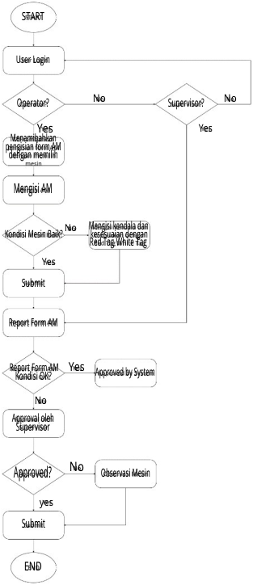

<!-- Start of picture text -->
START User Login Operator? No Supervisor? No Yes Yes Menamibahkan pengisian form AM dengan memilih Mengisi AM Kondisi Mesin Baik? No Mengisi kendala dankesesuaian dengan Red Tag White Tag Yes Submit Report Form AM Report Form AMKondisi OK? Yes Approved by System No Approval oleh Supervisor No Approved? Observasi Mesin yes Submit END <!-- End of picture text -->

Gambar 1. Flowchart Digital Form AM 

Lampiran 1 – WI-QO-QO-1007.00 

Dokumen ini telah ditandatangani secara elektronik menggunakan aplikasi FUPD Online dengan melampirkan lembar persetujuan elektronik milik PT. Bintang Toedjoe (A Kalbe Company) APPROVED 

Halaman : 6/31 

<mark>Zoho Sign Document ID: 34EDBFD6-QDQHEQQMSF4UJJ2CRLOZWHQEDMS6WQQPS6C7ZDNJXOA</mark> 

~~4~~bintangtoedjoe A Kalbe Company 

URS (PRODUCTION - PLG) 

##### **C. REQUIREMENTS** 

##### **1. Operational Requirements** 

##### **1.1. Functional Requirements** 

URS ini terbagi menjadi beberapa tingkatan level sesuai dengan persyaratan masing-masing area terhadap bisnis prosesnya, sebagai berikut : 

- I : Penting (ketersediaan fitur tersebut dalam system computer dapat mempengaruhi keberlangsungan/kelancaran proses bisnis) 

● D : Diinginkan (diharapkan tersedia fitur tersebut untuk mendukung kegiatan/proses) 

Tabel 1. Operational Requirements 

|**No.**|**Tahapan**|**Informasi yang** **dibutuhkan**|**Sumber** **Data**|**Requirement**|**GMP**|**Rank**|
|---|---|---|---|---|---|---|
|**1.**|**REGISTRASI AKU**|**N**|||||
|1.1|Input Data Registrasi|Nama, email, username, password, area, profile picture|Key In| Untuk pendaftaran akun baru, dapat melakukan registrasi baru dengan menginput nama, email, username, area, mesin, password, user role, dan profile picture.  Untuk ketentuan username menggunakan NIK dan password menggunakan huruf kapital, huruf kecil, angka dan spesial karakter dengan ketentuan password 8 karakter.  Setelah user melakukan registrasi, maka dapat menghubungi administrator agar dapat diaktivasi.|Y|I|

<u>Dokumen ini telah ditandatangani secara elektronik menggunakan aplikasi FUPD Online dengan melampirkan lembar persetujuan elektronik milik PT.</u> 

Bintang Toedjoe (A Kalbe Company) APPROVED 

Lampiran 1 – WI-QO-QO-1007.00 

Halaman : 7/31 

<mark>Zoho Sign Document ID: 34EDBFD6-QDQHEQQMSF4UJJ2CRLOZWHQEDMS6WQQPS6C7ZDNJXOA</mark> 

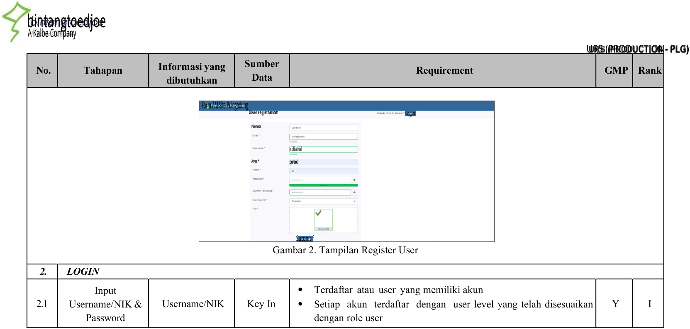

<!-- Start of picture text -->
bintangtoedjoe A Kalbe Company URS (PRODUCTION- PLG) Sumber No. Tahapan Informasi yang Requirement GMP Rank Data dibutuhkan  Form AM Site Pulogadung User registration Login Nema colbatrial Area* prod Sutonit f Gambar 2. Tampilan Register User 2. LOGIN Input  Terdaftar atau user yang memiliki akun 2.1 Username/NIK & Username/NIK Key In  Setiap akun terdaftar dengan user level yang telah disesuaikan Y I Password dengan role user <!-- End of picture text -->

<u>Dokumen ini telah ditandatangani secara elektronik menggunakan aplikasi FUPD Online dengan melampirkan lembar persetujuan elektronik milik PT.</u> Lampiran 1 – WI-QO-QO-1007.00 Bintang Toedjoe (A Kalbe Company) Halaman : 8/31 APPROVED 

<mark>Zoho Sign Document ID: 34EDBFD6-QDQHEQQMSF4UJJ2CRLOZWHQEDMS6WQQPS6C7ZDNJXOA</mark> 

bintangtoedjoe A Kalbe Company 

|**No.**|**Tahapan**|**Informasi yang** **dibutuhkan**|**Sumber** **Data**|**Requirement** UR|**GMP** S (PROD|**Rank** UCTION- PLG)|
|---|---|---|---|---|---|---|
|1.2||Password|Key In|Password harus sesuai dengan akun yang terdaftar Apabila user salah memasukkan password sebanyak 3 kali maka akses akan terkunci dan status akun menjadi “blocked” Bagi user yang status akun adalah “blocked” silakan menghubungi administrator. Apabila user lupa akun, maka dapat melakukan reset password dengan kredensial sesuai dengan email yang telah diinput ketika pendaftaran akun.|Y|I|
|||Form AM Site P|ulogadung||||
|||AM a U Us Rem|Online Pulogadung ser Login emame ember Me Reset Password? Login a Don't Have an Account?Rogistor|omous Maintenance di area masing-m|||

Gambar 3. Tampilan Login 

<u>Dokumen ini telah ditandatangani secara elektronik menggunakan aplikasi FUPD Online dengan melampirkan lembar persetujuan elektronik milik PT.</u> Lampiran 1 – WI-QO-QO-1007.00 Bintang Toedjoe (A Kalbe Company) Halaman : 9/31 APPROVED 

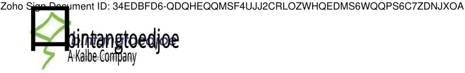

<!-- Start of picture text -->
Zoho Sign Document ID: 34EDBFD6-QDQHEQQMSF4UJJ2CRLOZWHQEDMS6WQQPS6C7ZDNJXOA 口 bintangtoedjoe A Kalbe Company <!-- End of picture text -->

##### URS (PRODUCTION - PLG) 

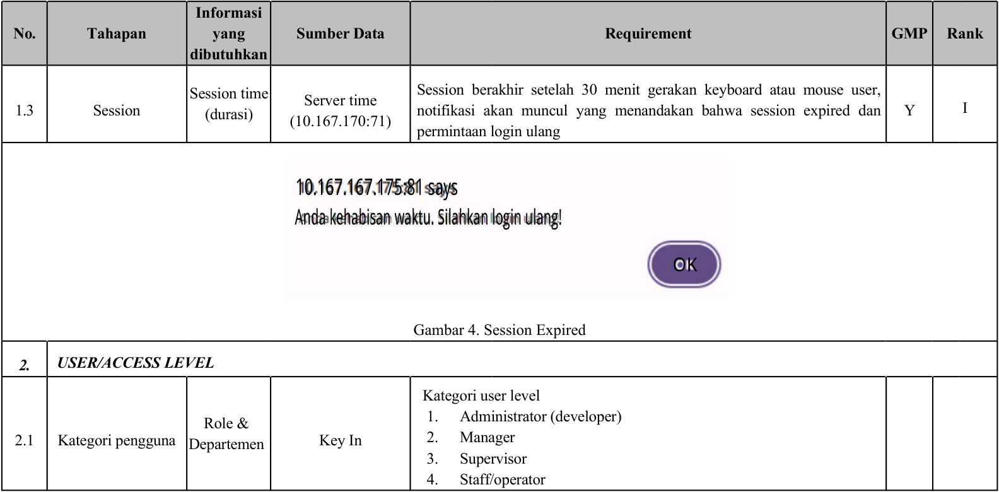

<!-- Start of picture text -->
Informasi No. Tahapan yang Sumber Data Requirement GMP Rank dibutuhkan Session time Session berakhir setelah 30 menit gerakan keyboard atau mouse user, Server time 1.3 Session (durasi) notifikasi akan muncul yang menandakan bahwa session expired dan Y I (10.167.170:71) permintaan login ulang 10.167.167.175:81 says Anda kehabisan waktu. Silahkan login ulang! OK Gambar 4. Session Expired 2. USER/ACCESS LEVEL Kategori user level Role & 1. Administrator (developer) 2.1 Kategori pengguna Departemen Key In 2. Manager 3. Supervisor 4. Staff/operator <!-- End of picture text -->

|La|mpiran 1–WI-QO-QO-1007.00|
|---|---|
|Dokumen ini telah ditandatangani secara elektronik menggunakan aplikasi FUPD Online dengan melampirkan lembar persetujuan elektronik milik PT. Bintang Toedjoe (A Kalbe Company) APPROVED|Halaman : 10/31|

> <mark>Zoho Sign Document ID: 34EDBFD6-QDQHEQQMSF4UJJ2CRLOZWHQEDMS6WQQPS6C7ZDNJXOA</mark> ~~4~~bintangtoedjoe A Kalbe Company 

#### URS (PRODUCTION - PLG) 

|**No.**|**Tahapan**|**Informasi** **yang** **dibutuhkan**|**Sumber Data**|**Requirement**|**GMP**|**Rank**|
|---|---|---|---|---|---|---|
|2.2|Access Level|Kewenanga n User|Key In|Administrator (developer) memiliki kewenangan untuk mengakses seluruh fitur dan menu di website E-AM, yakni berupa Home, Autonomous Maintenance, Approval, Users, dan Panduan Pengisian AM. Manager memiliki kewenangan untuk mengakses menu Home, Autonomous Maintenance, Approval, dan Panduan Pengisian AM. Supervisor memiliki kewenangan untuk mengakses menu Home, Autonomous Maintenance, Users, Approval, dan Panduan Pengisian AM. Staff/Operator memiliki kewenangan untuk mengakses menu Home, Autonomous Maintenance,dan Panduan Pengisian AM.|||
|**_3._**|**_NAVIGATION_**||||||
|3.1|Navigation|Administrat or Login|Key In|Administrator memiliki kewenangan untuk mengakses seluruh halaman dan menu yang tersedia di dalam website. Halaman dan menu yang dapat diakses oleh administrator yaitu: 1. Home Pada halaman ini, akan tertampil list mesin-mesin yang telah dikategorikan dengan tampilan horizontal. Setelah menekan salah satu mesin, maka akan menuju halaman form AM mesin yang telah terisi. Administrator dapat mengakses menu view, approval, edit data, delete form. Administrator juga dapat menambahkan pengisian form AM baru(add new machine)serta melakukan export data dalam|Y|I|

<u>Lampiran 1 – WI-QO-QO-1007.00</u> Dokumen ini telah ditandatangani secara elektronik menggunakan aplikasi FUPD Online dengan melampirkan lembar persetujuan elektronik milik PT. Bintang Halaman : 11/31 Toedjoe (A Kalbe Company) APPROVED 

> <mark>Zoho Sign Document ID: 34EDBFD6-QDQHEQQMSF4UJJ2CRLOZWHQEDMS6WQQPS6C7ZDNJXOA</mark> ~~4~~bintangtoedjoe A Kalbe Company 

##### URS (PRODUCTION - PLG) 

|**No.**|**Tahapan**|**Informasi** **yang** **dibutuhkan**|**Sumber Data**|**Requirement**|**GMP**|**Rank**|
|---|---|---|---|---|---|---|
|||||bentuk PDF, Microsoft (Ms.) Word, CSV, dan Ms. Excel). 2. AM Mesin Pada halaman ini, akan tertampil list mesin-mesin yang telah dikategorikan dengan tampilan vertical pada sidebar. Setelah menekan salah satu mesin, maka akan menuju halaman form AM mesin yang telah terisi. Administrator dapat mengakses menu view, approval, edit data, delete form. Administrator juga dapat menambahkan pengisian form AM baru (add new machine) serta melakukan export data dalam bentuk PDF, Microsoft (Ms.) Word, CSV, dan Ms. Excel) 3. Approval Pada section ini terdapat menu view, approval, edit data, dan delete.  View Pada menu view, form AM yang telah terisi akan tertampil kondisi sesuai poinnya. Administrator mendapatkan akses untuk export, approval, edit data, dan delete. Data dapat di export dalam bentuk PDF, Ms. Word, CSV, dan Ms. Excel.  Approval Form yang telah diinput dengan kondisi baik semua (OK) akan otomatis approved by system, sedangkan form AM dengan kondisi status tidak baik (NOK) dapat diapprove manual oleh administrator, apakah statusnya approve atau not approve.  Edit Data|||

<u>Lampiran 1 – WI-QO-QO-1007.00</u> 

Dokumen ini telah ditandatangani secara elektronik menggunakan aplikasi FUPD Online dengan melampirkan lembar persetujuan elektronik milik PT. Bintang Toedjoe (A Kalbe Company) APPROVED 

Halaman : 12/31 

> <mark>Zoho Sign Document ID: 34EDBFD6-QDQHEQQMSF4UJJ2CRLOZWHQEDMS6WQQPS6C7ZDNJXOA</mark> ~~4~~bintangtoedjoe 

A Kalbe Company 

#### URS (PRODUCTION - PLG) 

|**No.**|**Tahapan**|**Informasi** **yang** **dibutuhkan**|**Sumber Data**|**Requirement**|**GMP**|**Rank**|
|---|---|---|---|---|---|---|
|||||Menu ini memberikan fungsi untuk melakukan perubahan terhadap form AM.  Delete Administrator dapat melakukan delete form AM. 4. Users Pada menu ini, akses yang tersedia yaitu untuk view user, edit user, export, dan delete user, serta dapat menambahkan user baru dengan add user. 5. Panduan Pengisian AM Menu ini berupapanduanpengisian AM.|||
|||Manager|Key In|Manager memiliki kewenangan untuk mengakses fitur-fitur yang ada di halaman website dan menu yang dapat diakses oleh Manager yaitu: 1. Home Pada halaman ini, akan tertampil list mesin-mesin yang telah dikategorikan dengan tampilan horizontal. Setelah menekan salah satu mesin, maka akan menuju halaman form AM mesin yang telah terisi. Manager dapat mengakses menu view, approval, edit data, delete form. Manager dapat melakukan melakukan export data dalam bentuk PDF, Microsoft (Ms.) Word, CSV, dan Ms. Excel). 2. AM Mesin Pada halaman ini, akan tertampil list mesin-mesin yang telah dikategorikan dengan tampilan vertical pada sidebar. Setelah menekan salah satu mesin, maka akan menuju halaman form AM|Y|I|

<u>Lampiran 1 – WI-QO-QO-1007.00</u> Dokumen ini telah ditandatangani secara elektronik menggunakan aplikasi FUPD Online dengan melampirkan lembar persetujuan elektronik milik PT. Bintang Halaman : 13/31 Toedjoe (A Kalbe Company) APPROVED 

> <mark>Zoho Sign Document ID: 34EDBFD6-QDQHEQQMSF4UJJ2CRLOZWHQEDMS6WQQPS6C7ZDNJXOA</mark> ~~4~~bintangtoedjoe A Kalbe Company 

##### URS (PRODUCTION - PLG) 

|**No.**|**Tahapan**|**Informasi** **yang** **dibutuhkan**|**Sumber Data**|**Requirement**|**GMP**|**Rank**|
|---|---|---|---|---|---|---|
|||||mesin yang telah terisi. Manager dapat mengakses menu view, approval, edit data, delete form. Manager dapat melakukan export data dalam bentuk PDF, Microsoft (Ms.) Word, CSV, dan Ms. Excel) 3. Approval Pada section ini terdapat menu view, approval, edit data, dan delete.  View Pada menu view, form AM yang telah terisi akan tertampil kondisi sesuai poinnya. Manager mendapatkan akses untuk export, approval, edit data, dan delete. CSV, dan Ms. Excel.  Approval Form yang telah diinput dengan kondisi baik semua (OK) akan otomatis approved by system, sedangkan form AM dengan kondisi status tidak baik (NOK) dapat diapprove manual oleh manager, apakah statusnya approve atau disapprove (not approved).  Edit Data Untuk menu edit data, manager hanya diperbolehkan untuk mengedit data berdasarkan historical approvalnya. Manager tidak diperkenankan melakukan edit data dari submission user lain. 4. Panduan Pengisian AM Menu ini berupapanduanpengisian AM|||

|La|mpiran 1–WI-QO-QO-1007.00|
|---|---|
|Dokumen ini telah ditandatangani secara elektronik menggunakan aplikasi FUPD Online dengan melampirkan lembar persetujuan elektronik milik PT. Bintang Toedjoe (A Kalbe Company)|Halaman : 14/31|
|APPROVED||

> <mark>Zoho Sign Document ID: 34EDBFD6-QDQHEQQMSF4UJJ2CRLOZWHQEDMS6WQQPS6C7ZDNJXOA</mark> ~~4~~bintangtoedjoe A Kalbe Company 

##### URS (PRODUCTION - PLG) 

|**No.**|**Tahapan**|**Informasi** **yang** **dibutuhkan**|**Sumber Data**|**Requirement**|**GMP**|**Rank**|
|---|---|---|---|---|---|---|
|||Supervisor|Key In|Supervisor memiliki kewenangan untuk mengakses fitur-fitur yang ada di halaman website dan menu yang dapat diakses oleh Supervisor yaitu: 1. Home Pada halaman ini, akan tertampil list mesin-mesin yang telah dikategorikan dengan tampilan horizontal. Setelah menekan salah satu mesin, maka akan menuju halaman form AM mesin yang telah terisi. Supervisor dapat mengakses menu view, approval, edit data, delete form. Supervisor dapat melakukan export data dalam bentuk PDF, Microsoft (Ms.) Word, CSV, dan Ms. Excel). 2. AM Mesin Pada halaman ini, akan tertampil list mesin-mesin yang telah dikategorikan dengan tampilan vertical pada sidebar. Setelah menekan salah satu mesin, maka akan menuju halaman form AM mesin yang telah terisi. Supervisor dapat mengakses menu view, approval, edit data, delete form. Supervisor dapat melakukan export data dalam bentuk PDF, Microsoft (Ms.) Word, CSV, dan Ms. Excel) 3. Approval Pada section ini terdapat menu view, approval, dan edit data.  View Pada menu view, form AM yang telah terisi akan tertampil kondisi sesuai poinnya. Supervisor mendapatkan akses untuk export, approval, edit data, dan delete. CSV,dan Ms. Excel.|||

<u>Lampiran 1 – WI-QO-QO-1007.00</u> 

Dokumen ini telah ditandatangani secara elektronik menggunakan aplikasi FUPD Online dengan melampirkan lembar persetujuan elektronik milik PT. Bintang Toedjoe (A Kalbe Company) 

Halaman : 15/31 

APPROVED 

> <mark>Zoho Sign Document ID: 34EDBFD6-QDQHEQQMSF4UJJ2CRLOZWHQEDMS6WQQPS6C7ZDNJXOA</mark> ~~4~~bintangtoedjoe A Kalbe Company 

#### URS (PRODUCTION - PLG) 

|**No.**|**Tahapan**|**Informasi** **yang** **dibutuhkan**|**Sumber Data**|**Requirement**|**GMP**|**Rank**|
|---|---|---|---|---|---|---|
||||| Approval Form yang telah diinput dengan kondisi baik semua (OK) akan otomatis approved by system, sedangkan form AM dengan kondisi status tidak baik (NOK) dapat diapprove manual oleh supervisor, apakah statusnya approve atau disapprove (not approved).  Edit Data Untuk menu edit data, hanya diperbolehkan untuk mengedit data berdasarkan historical approvalnya. Supervisor tidak diperkenankan melakukan edit data dari submission user lain. 4. Panduan Pengisian AM Menu ini berupapanduanpengisian AM|||
|||Staff/ Operator|Key In|Staff/Operator memiliki kewenangan untuk mengakses fitur-fitur yang ada di halaman website dan menu sebagai berikut yaitu: 1. Home Pada halaman ini, akan tertampil list mesin-mesin yang telah dikategorikan dengan tampilan horizontal. Setelah menekan salah satu mesin, maka akan menuju halaman form AM mesin yang telah terisi. Juga dapat melakukan melakukan export data dalam bentuk PDF, Microsoft (Ms.) Word, CSV, dan Ms. Excel). 2. AM Mesin Pada halaman ini, akan tertampil list mesin-mesin yang telah dikategorikan dengan tampilan vertical pada sidebar. Setelah menekan salah satu mesin, maka akan menuju halaman form AM|||

<u>Lampiran 1 – WI-QO-QO-1007.00</u> Dokumen ini telah ditandatangani secara elektronik menggunakan aplikasi FUPD Online dengan melampirkan lembar persetujuan elektronik milik PT. Bintang Halaman : 16/31 Toedjoe (A Kalbe Company) APPROVED 

> <mark>Zoho Sign Document ID: 34EDBFD6-QDQHEQQMSF4UJJ2CRLOZWHQEDMS6WQQPS6C7ZDNJXOA</mark> ~~4~~bintangtoedjoe A Kalbe Company 

#### URS (PRODUCTION - PLG) 

|**No.**|**Tahapan**|**Informasi** **yang** **dibutuhkan**|**Sumber Data**|**Requirement**|**GMP**|**Rank**|
|---|---|---|---|---|---|---|
|||||mesin yang telah terisi. Staff/Operator dapat mengakses menu view dan edit data. Juga dapat melakukan export data dalam bentuk PDF, Microsoft (Ms.) Word, CSV, dan Ms. Excel)  View Pada menu view, form AM yang telah terisi akan tertampil kondisi sesuai poinnya. Staff/Operator dapat akses untuk export dan edit data. CSV, dan Ms. Excel.  Edit Data Untuk menu edit data, hanya diperbolehkan untuk mengedit data berdasarkan historical approvalnya. Staff/Operator tidak diperkenankan melakukan edit data dari submission user lain. 3. Panduan Pengisian AM Menu ini berupapanduanpengisian AM|||

###### <u>Lampiran 1 – WI-QO-QO-1007.00</u> 

|Dokumen ini telah ditandatangani secara elektronik menggunakan aplikasi FUPD Online dengan melampirkan lembar persetujuan elektronik milik PT. Bintang Toedjoe (A Kalbe Company)|Halaman : 17/31|
|---|---|
|APPROVED||

<mark>Zoho Sign Document ID: 34EDBFD6-QDQHEQQMSF4UJJ2CRLOZWHQEDMS6WQQPS6C7ZDNJXOA</mark> 

<!-- Start of picture text -->
bintangtoedjoe A Kalbe Company <!-- End of picture text -->

##### URS (PRODUCTION - PLG) 

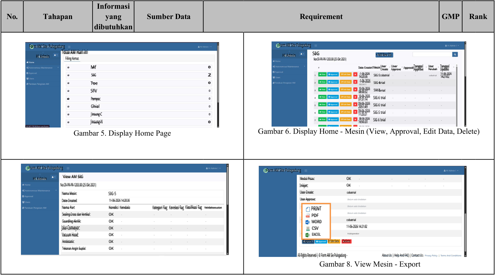

<!-- Start of picture text -->
Informasi No. Tahapan yang Sumber Data Requirement GMP Rank dibutuhkan Form AM Site Pulogadung Form AM Site Pulogadung Hi Admin Total AM Hari ini Hi Admin SIG + Add New SIG Filling Kemas NorCR-PR-PR-1203.00 (25 Okt 2021) Mf 0 Date CreatedMesinCreate User UserApprove Approvèl Tanggal Approve UserPerubah UpdateTanggal SIG 2 14:20:361-06-2026 SIG 5cobatrial 11-06-2026142102 Toe 0 1-06-2026 SIG 6trial STV 08:00:3210-06-2026 5965brial e Pampac 07:31:1410-06-2026 SIG 6 trial Chial 2051:4909-06-2026 SIG 6 trial Jinsung C 09-06-202611:25:21 SIG S trial Jinsung N 0 1650:2008-06-2026 SIG 6 brial Gambar 6. Display Home - Mesin (View, Approval, Edit Data, Delete) Gambar 5. Display Home Page Form AM Site Pulogadung Form AM Site Pulogadung Hi Admin View AM SIG Modul Pisau: OK No:CR-PR-PR-1203.00 (25 Okt 2021) Inkjet: OK Nama Mesin: SIG 5 User Create: cobatrial Date Created: 11-06-2026 14:20:36 User Approve: Nama Part Kondisi Kendala Kategori Tag Korelasi Tag Klasifikasi Tag Ketidaksesuaian PRINT Sealing Cross dan Vertikal: OK PDF Guardling Akrilik: OK WORD cobatrial Jalur Comveyor: OK CSV 11-06-2026 14:21:02 Vacuum Hood: OK EXCEL Antistatic OK  Export Or Ede Data  Delete Tekanan Angin Suplai: OK All Rights Reserved | © Form AM Sie Pulogadung - About Us | Help And FAQ | Contact Us Gambar 8. View Mesin - Export <!-- End of picture text -->

<u>Lampiran 1 – WI-QO-QO-1007.00</u> 

Dokumen ini telah ditandatangani secara elektronik menggunakan aplikasi FUPD Online dengan melampirkan lembar persetujuan elektronik milik PT. Bintang Toedjoe (A Kalbe Company) APPROVED 

Halaman : 18/31 

<mark>Zoho Sign Document ID: 34EDBFD6-QDQHEQQMSF4UJJ2CRLOZWHQEDMS6WQQPS6C7ZDNJXOA</mark> 

<!-- Start of picture text -->
bintangtoedjoe A Kalbe Company <!-- End of picture text -->

##### URS (PRODUCTION - PLG) 

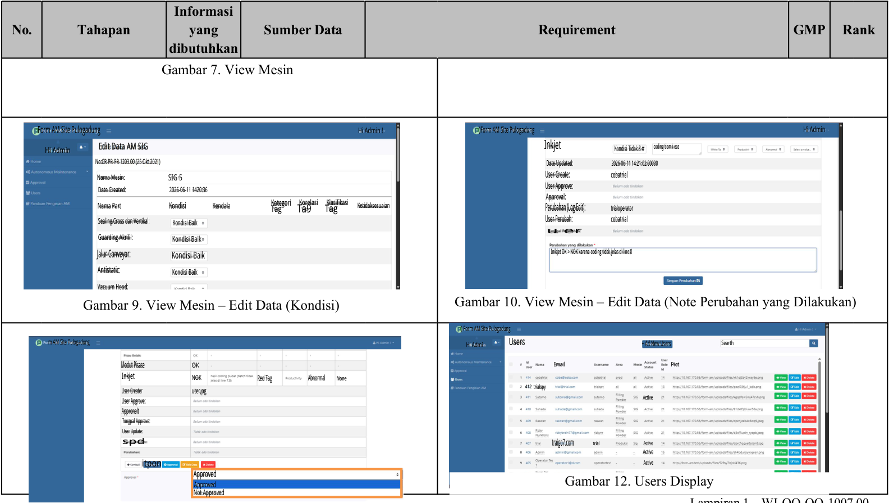

<!-- Start of picture text -->
Informasi No. Tahapan yang Sumber Data Requirement GMP Rank dibutuhkan Gambar 7. View Mesin Form AM Site Pulogadung  Hi Admin ! )Form AM Site Pulogadung Hi Admin Hi Admin Edit Data AM SIG Inkjet Kondisi Tidak 8 # coding tiomk eas No:CR-PR-PR-1203.00 (25 Okt 2021) Date Updated: 2026-06-11 14:21:02:00000 Nama Mesin: SIG 5 User Create: cobatrial Date Created: 2026-06-11 1420:36 User Approve: Approval: Nama Part Kondisi Kendala KategoriTag Ta9Korelasi TagKlasifikasi Ketidaksesuaian Perubahan (Log Edit): trialoperator Sealing Cross dan Vertikal: Kondisi Baik User Perubah: cobatrial u er Guarding Akrilil: Kondisi Baik Jalur Conveyor: Kondisi Baik  Inikjet OK > NOK karena coding tidak jelas di line 8 Antistatic: Kondisi Baik Vacuum Hood: Gambar 9. View Mesin – Edit Data (Kondisi) Gambar 10. View Mesin – Edit Data (Note Perubahan yang Dilakukan) ) Form AM Site Pulogadung m AM Site Pulogadung Hi Admi Users + Ad New Users Searth Modut Pisase OK Email Pict Inkjet NOK Red Tag Abnormal None User Creater uter,pg 412 trialspy User Apgrove: Active Appronalt Tangpal Approve: User Update: spd  traigo7.com trial Active Active itpon Active Approved Approved Gambar 12. Users Display Not Approved <!-- End of picture text -->

<u>Lampiran 1 – WI-QO-QO-1007.00</u> 

Dokumen ini telah ditandatangani secara elektronik menggunakan aplikasi FUPD Online dengan melampirkan lembar persetujuan elektronik milik PT. Bintang Toedjoe (A Kalbe Company) APPROVED 

Halaman : 19/31 

<mark>Zoho Sign Document ID: 34EDBFD6-QDQHEQQMSF4UJJ2CRLOZWHQEDMS6WQQPS6C7ZDNJXOA</mark> 

<!-- Start of picture text -->
bintangtoedjoe A Kalbe Company <!-- End of picture text -->

##### URS (PRODUCTION - PLG) 

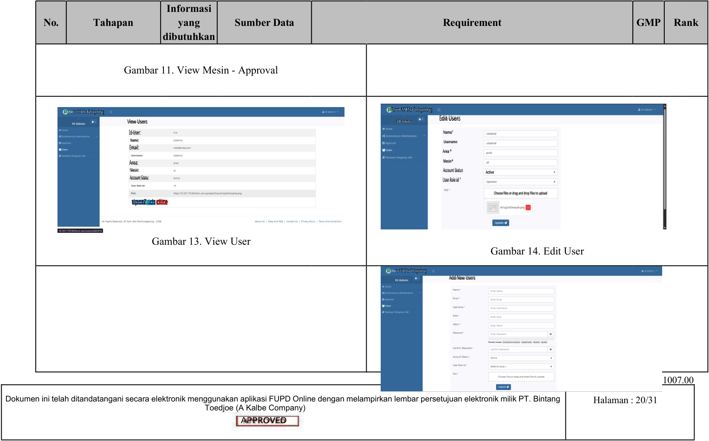

<!-- Start of picture text -->
Informasi No. Tahapan yang Sumber Data Requirement GMP Rank dibutuhkan Gambar 11. View Mesin - Approval m AM Site Pulogadung Form AM Site Pulogadung View Users Hi Admin Edit Users Id User: Nama" Namic Usemame Email: Area * Area: Mesin* Mesin: Account Status Active Account Statu: User Role id " Choose files or drag and drop files to upload tipotZ idt dlite Gambar 13. View User Gambar 14. Edit User m AM Site Pulogadung Add New Users Lampiran 1 – WI-QO-QO-1007.00 Dokumen ini telah ditandatangani secara elektronik menggunakan aplikasi FUPD Online dengan melampirkan lembar persetujuan elektronik milik PT. Bintang Halaman : 20/31 Toedjoe (A Kalbe Company) APPROVED <!-- End of picture text -->

<mark>Zoho Sign Document ID: 34EDBFD6-QDQHEQQMSF4UJJ2CRLOZWHQEDMS6WQQPS6C7ZDNJXOA</mark> 

bintangtoedjoe A Kalbe Company 

##### URS (PRODUCTION - PLG) 

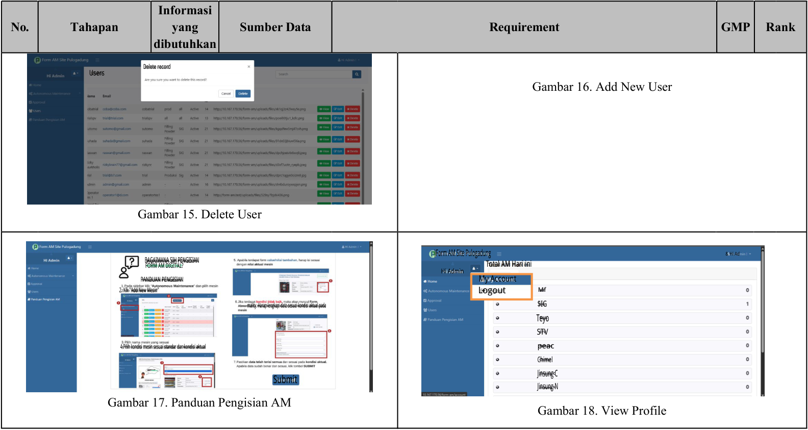

<!-- Start of picture text -->
Informasi No. Tahapan yang Sumber Data Requirement GMP Rank dibutuhkan Delete record Users Gambar 16. Add New User Gambar 15. Delete User )Form AM Site Pulogadung & Hi Ad BAGAIMANA SIH PENGISIAN FORM AM DIGITAL? Total AM Hari ini Hi Admin PANDUAN PENGISIAN My Account 2. Klk "Add New Mesin" Logout Mf mality. Harap lengkapi data sesuai kondisi aktual pada $IG Teyo STV 4.Pilih kondisi mesin sesuai standar dan kondisi aktual peac Chimel Jinsung C Submit Jinsung N Gambar 17. Panduan Pengisian AM Gambar 18. View Profile <!-- End of picture text -->

<u>Lampiran 1 – WI-QO-QO-1007.00</u> Dokumen ini telah ditandatangani secara elektronik menggunakan aplikasi FUPD Online dengan melampirkan lembar persetujuan elektronik milik PT. Bintang Halaman : 21/31 Toedjoe (A Kalbe Company) APPROVED 

<mark>Zoho Sign Document ID: 34EDBFD6-QDQHEQQMSF4UJJ2CRLOZWHQEDMS6WQQPS6C7ZDNJXOA</mark> 

<!-- Start of picture text -->
bintangtoedjoe A Kalbe Company <!-- End of picture text -->

##### URS (PRODUCTION - PLG) 

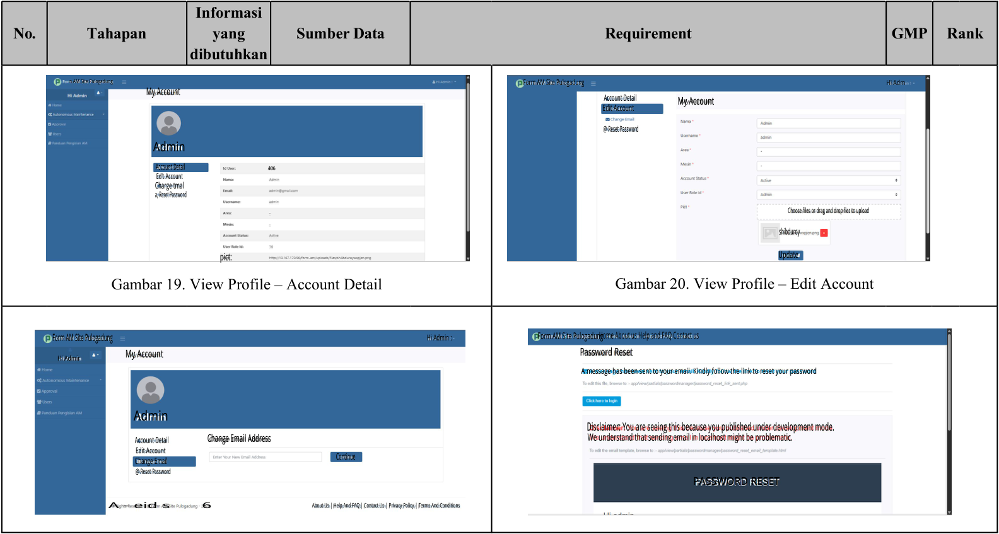

<!-- Start of picture text -->
Informasi No. Tahapan yang Sumber Data Requirement GMP Rank dibutuhkan n AM Site Pulogadung Form AM Site Pulogadung Hi Adm My Account Account Detail My Account Edit Account @ Reset Password Admin  Account Detail 406  Ed't Account Charge tmal a, Reset Password Choose files or drag and drop fles to upload shibduroy pict: Update Gambar 19. View Profile – Account Detail Gambar 20. View Profile – Edit Account Form AM Site Pulogadung  Hi Admin : Form AM Site Pulogadung Home About us Help and FAQ Contact us Hi Admir My Account Password Reset A message has been sent to your email. Kindly follow the link to reset your password Admin Disclaimer: You are seeing this because you published under development mode. Account Detail Change Email Address We understand that sending email in localhost might be problematic.  Edit Account Continue Change Email @ Reset Password PASSWORD RESET A - eid s       6 About Us | Help And FAQ | Contact Us | Privacy Policy | Terms And Conditions <!-- End of picture text -->

<u>Lampiran 1 – WI-QO-QO-1007.00</u> 

Dokumen ini telah ditandatangani secara elektronik menggunakan aplikasi FUPD Online dengan melampirkan lembar persetujuan elektronik milik PT. Bintang Toedjoe (A Kalbe Company) APPROVED 

Halaman : 22/31 

<mark>Zoho Sign Document ID: 34EDBFD6-QDQHEQQMSF4UJJ2CRLOZWHQEDMS6WQQPS6C7ZDNJXOA</mark> 

bintangtoedjoe A Kalbe Company 

URS (PRODUCTION - PLG) 

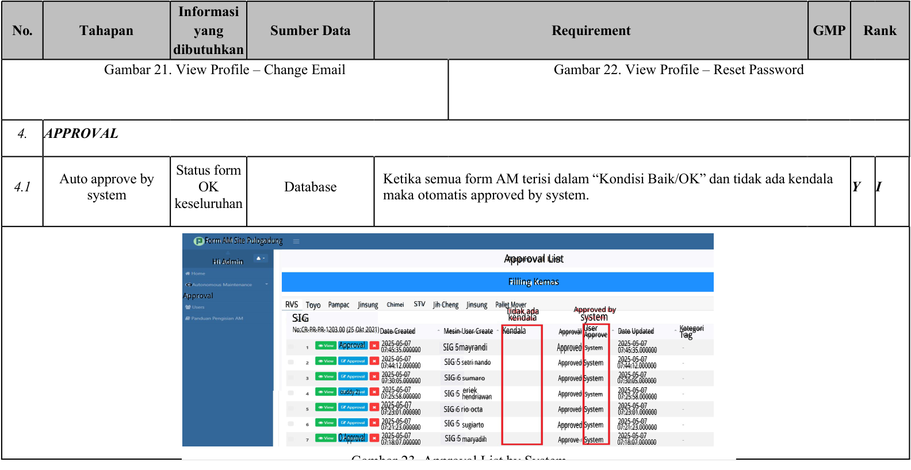

<!-- Start of picture text -->
Informasi No. Tahapan yang Sumber Data Requirement GMP Rank dibutuhkan Gambar 21. View Profile – Change Email Gambar 22. View Profile – Reset Password 4. APPROVAL Status form Auto approve by Ketika semua form AM terisi dalam “Kondisi Baik/OK” dan tidak ada kendala 4.1 OK Database Y I system maka otomatis approved by system. keseluruhan Form AM Site Pulogadung Hi Admin Approval List o Filling Kemas Approval RVS Toyo Pampac Jinsung Chimei STV Jih Cheng Jinsung Pallet Mover Tidak ada Approved by SIG kendala system No:CR-PR-PR-1203.00 (25 Okt 2021)Date Created Mesin User Create Kendala Approväl User Approve Date Updated KategoriTag Approval 07:45:35.0000002025-05-07 SIG 5mayrandi Approved System 07:45:35.0000002025-05-07 07:44:12.0000002025-05-07 SIG 5 setri nando Approved System 07:44:12.0000002025-05-07 07:30:05.0000002025-05-07 SIG 6 sumaro Approved System 07:30:05.0000002025-05-07 ouddy 2) 07:25:58.0000002025-05-07 SIG 5 hendriawaneriek Approved System 07:25:58.0000002025-05-07 07:23:01.0000002025-05-07 SIG 6 rio octa Approved System 07:23:01.0000002025-05-07 07:21:23.0000002025-05-07 SIG 5 sugiarto Approved System 07:21:23.0000002025-05-07 O Approval 07:18:07.0000002025-05-07 SIG 5 maryadih Approve System 07:18:07.0000002025-05-07 Gambar 23 Approval List by System <!-- End of picture text -->

<u>Lampiran 1 – WI-QO-QO-1007.00</u> 

Dokumen ini telah ditandatangani secara elektronik menggunakan aplikasi FUPD Online dengan melampirkan lembar persetujuan elektronik milik PT. Bintang Toedjoe (A Kalbe Company) APPROVED 

Halaman : 23/31 

<mark>Zoho Sign Document ID: 34EDBFD6-QDQHEQQMSF4UJJ2CRLOZWHQEDMS6WQQPS6C7ZDNJXOA</mark> 

<!-- Start of picture text -->
bintangtoedjoe A Kalbe Company <!-- End of picture text -->

##### URS (PRODUCTION - PLG) 

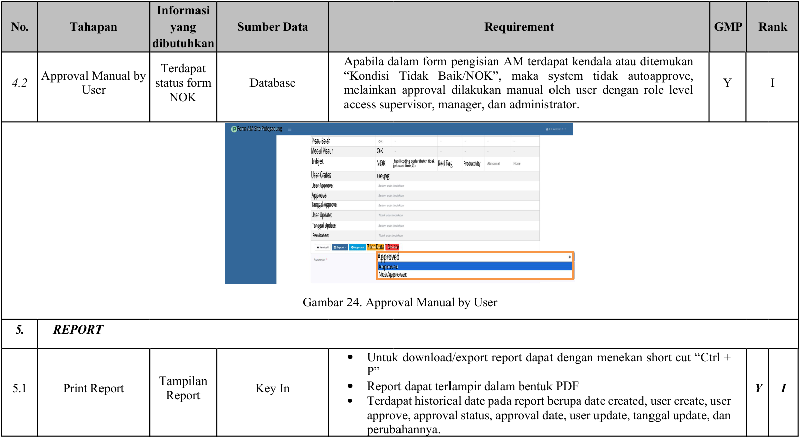

<!-- Start of picture text -->
Informasi No. Tahapan yang Sumber Data Requirement GMP Rank dibutuhkan Apabila dalam form pengisian AM terdapat kendala atau ditemukan Terdapat Approval Manual by “Kondisi Tidak Baik/NOK”, maka system tidak autoapprove, 4.2 status form Database Y I User melainkan approval dilakukan manual oleh user dengan role level NOK access supervisor, manager, dan administrator. Form AM Site Pulogadung Pisau Belah: Modul Pisaur OK Inkjet NOK jelas di line 7,)hasil coding pudar (batch tidak Red Tag Productivity User Crates ue,pg User Approve: Approval: Tanggal Approve: User Update: Tanggal Update: Perubahan: 7 ldt Duta I Delete Approved Approved Not Approved Gambar 24. Approval Manual by User 5. REPORT  Untuk download/export report dapat dengan menekan short cut “Ctrl + P” 5.1 Print Report Tampilan Key In  Report dapat terlampir dalam bentuk PDF Y I Report  Terdapat historical date pada report berupa date created, user create, user approve, approval status, approval date, user update, tanggal update, dan perubahannya. <!-- End of picture text -->

###### <u>Lampiran 1 – WI-QO-QO-1007.00</u> 

Dokumen ini telah ditandatangani secara elektronik menggunakan aplikasi FUPD Online dengan melampirkan lembar persetujuan elektronik milik PT. Bintang Toedjoe (A Kalbe Company) 

Halaman : 24/31 

APPROVED 

<mark>Zoho Sign Document ID: 34EDBFD6-QDQHEQQMSF4UJJ2CRLOZWHQEDMS6WQQPS6C7ZDNJXOA</mark> 

<!-- Start of picture text -->
bintangtoedjoe A Kalbe Company <!-- End of picture text -->

##### URS (PRODUCTION - PLG) 

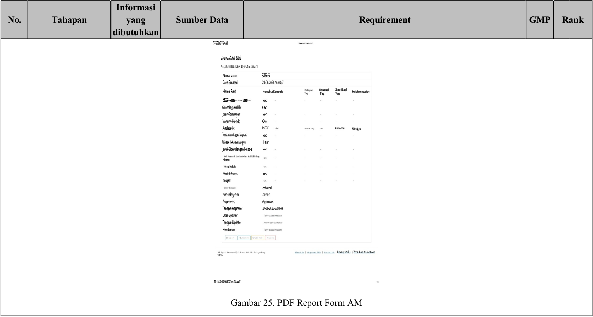

<!-- Start of picture text -->
Informasi No. Tahapan yang Sumber Data Requirement GMP Rank dibutuhkan 676706 764. 8 View AM SIG NxOR-PR·PR-1203.00:25 Ck: 20271 Nama Mesirc SI5 6 Date Created: 23-06-2026 16.03:(7 Nama Part Kondisi Kendala KorelaslTag KlaniflkaslTog Keticlalesesusion Se  s  oc Guarding Akrililk: 0c Jalur Comveyor: o< Vacum Hood: 0x Antistatic: NCK Abramal Ringls Tekanan Angin Suplai: oc Walue Tekanan Angln: 1 tar Jarak Sider dengan Nozzle: o< Shiem Plsau Belah: Modul Pisaus 0< tnkjet: cobatrial twauddy am admin Approzal: Approved Tanggel Appreve: 24-06-2026-0703:44 User Updater Tanggal Update: Perubahan: 2026 Prvasy Pulis 1 Zrra And Cundtiom 10 187 170.907ve 04μVT Gambar 25. PDF Report Form AM <!-- End of picture text -->

<u>Lampiran 1 – WI-QO-QO-1007.00</u> Dokumen ini telah ditandatangani secara elektronik menggunakan aplikasi FUPD Online dengan melampirkan lembar persetujuan elektronik milik PT. Bintang Halaman : 25/31 Toedjoe (A Kalbe Company) APPROVED 

<mark>Zoho Sign Document ID: 34EDBFD6-QDQHEQQMSF4UJJ2CRLOZWHQEDMS6WQQPS6C7ZDNJXOA</mark> 

URS (PRODUCTION - PLG) 

47bintangtoedjoe 

A Kalbe Company 

##### **2. Technical Requirements** 

##### **2.1 Spesifikasi Server** 

- ✔ Brand : VM SITE 

- ✔ OS : Windows Server 

- ✔ CPU : Intel Xeon E-2200 

- ✔ Memory : 4 GB RAM 

- ✔ Storage : Start from 200 GB 

- ✔ Display : 1366x768 

- a) Kebutuhan Minimum Perangkat Keras dan Sistem Operasi 

   - ✔ Aplikasi Autonomous Maintenance 

<u>Tabel 2. Spesifikasi Perangkat</u> 

|Aspek|Android|Windows|
|---|---|---|
|||Versi 32-bit atau 64-bit Windows|
|OS|Android 8 atau lebih|10/11, Windows 8/8.1|
|CPU|Octa Core atau lebih|1,6 GHz atau lebih tinggi|
|Memory|4GB atau lebih|4GB atau lebih|
|Storage|32GB atau lebih|500GB atau lebih|
|Display|720patau lebih|1080patau lebih|
|Connection|Wi-Fi,kabel LAN,atau diatasnya|Wi-Fi,kabel LAN,atau diatasnya|

- ✔ Server Form AM Digital 

<u>Tabel 3. Spesifikasi Server</u> 

|OS|Windows Server|
|---|---|
|CPU|Quad Core 3Ghz|
|Memory|8GB RAM|
|Storage|8 GB|
|Software|XAMPP|
|Bahasa Pemrograman|HTML,PHP,CSS,MySQL,JavaScript|
|Display|1366x768|

Lampiran 1 – WI-QO-QO-1007.00 

Dokumen ini telah ditandatangani secara elektronik menggunakan aplikasi FUPD Online dengan melampirkan lembar persetujuan elektronik milik PT. Bintang Toedjoe (A Kalbe Company) 

Halaman : 26/31 

APPROVED 

<mark>Zoho Sign Document ID: 34EDBFD6-QDQHEQQMSF4UJJ2CRLOZWHQEDMS6WQQPS6C7ZDNJXOA</mark> 口bintangtoedjoe 

URS (PRODUCTION - PLG) 

A Kalbe Company 

- b) Persediaan Listrik 

Persediaan listrik diperoleh dari local site. 

##### **3. Interfaces** 

- ✔ Aplikasi Form AM : Form AM Digital dapat diisi oleh user. 

- ✔ Aplikasi Form AM →Server : Data yang sudah diisi pada Aplikasi Form AM akan menjadi report bulanan dan dapat diekspor ke dalam format .pdf 

##### **4. Non-functional atribut** 

##### **4.1. Business Contingency Plan** 

- 4.1.1. Contingency Plan 

   - ✔ Apabila sistem dan/ atau jaringan error selama > 1 x 24 jam, maka pelaporan penyimpangan dilakukan secara manual dengan menggunakan form Laporan Penyimpangan & Potensi Penyimpangan (Lampiran 1 WI-QO-QS-1025) 

- 4.1.2. Disaster recovery & recovery time 

   - ✔ Jika terjadi disaster, seluruh data dan sistem harus dapat direcovery 

   - ✔ Recover terhadap sistem harus dilakukan dalam 2 x 24 jam, termasuk data transaksi yang belum terselesaikan. Data backup transaksi yang sudah terselesaikan harus dapat direcovery dalam kurun waktu maksimal 30 hari kalender. 

   - ✔ Major Disaster: 

      - Proses recovery all per server 

      - Mengaktifkan seluruh security system 

      - Zero trust issue 

##### **4.2. Back up, restore** 

- ✔ Sistem menyediakan pencadangan rutin (regular backup) untuk aplikasi dan data secara lengkap, yang dapat di-restore apabila diperlukan. 

- ✔ Dilakukan backup / restore test sebelum aplikasi diluncurkan (go-live) untuk memastikan backup aplikasi dan data dapat memulihkan system secara utuh dan berfungsi normal seperti kondisi saat backup dilakukan. 

- ✔ Data backup disimpan dengan masa simpan 5 tahun 

- ✔ Proses backup / restore test ini harus didokumentasikan dan menjadi bagian dari proses CSV 

##### **4.3. Server yang digunakan & data store** 

- ✔ Aplikasi dan data harus disimpan pada tempat yang aman dan sesuai dengan guideline yang 

   - Lampiran 1 – WI-QO-QO-1007.00 

Halaman : 27/31 

Dokumen ini telah ditandatangani secara elektronik menggunakan aplikasi FUPD Online dengan melampirkan lembar persetujuan elektronik milik PT. Bintang Toedjoe (A Kalbe Company) APPROVED 

<mark>Zoho Sign Document ID: 34EDBFD6-QDQHEQQMSF4UJJ2CRLOZWHQEDMS6WQQPS6C7ZDNJXOA</mark> ~~4~~bintangtoedjoe 

URS (PRODUCTION - PLG) 

A Kalbe Company 

ditetapkan oleh Corporate IT baik secara fisik maupun sistem sehingga terhindar dari kerusakan dan akses yang tidak berwenang. 

✔ Server menggunakan UPS (karena merupakan critical system) 

##### **D. OTHER REQUIREMENTS** 

##### **1. ALCOA requirement** 

- **1.1. Attributable** 

   - ✔ Administrator adalah PIC CSV dan Staf Digitalisasi. Administrator memiliki akses untuk menambah atau mengurangi user access _,_ mencetak report per bulan serta melakukan perubahan pada data yang salah. 

   - ✔ Manager dan Supervisor adalah orang yang bertanggung jawab untuk approval sebagai tanda bahwa pengisian form sudah dilakukan dengan benar. 

   - ✔ Operator adalah orang yang mengisi form setiap hari. 

   - ✔ Ruang lingkup dan Batasan akses aplikasi beserta menu menyesuaikan tipe user dan level masing- masing user sesuai tabel 4. 

Tabel 4. User Access Role 

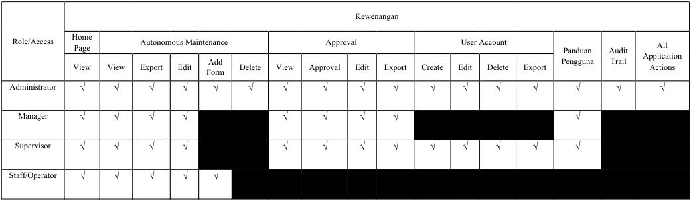

<!-- Start of picture text -->
Kewenangan Role/Access HomePage Autonomous Maintenance Approval User Account Panduan Audit All View View Export Edit FormAdd Delete View Approval Edit Export Create Edit Delete Export Pengguna Trail ApplicationActions Administrator √ √ √ √ √ √ √ √ √ √ √ √ √ √ √ √ √ Manager √ √ √ √ √ √ √ √ √ √ Supervisor √ √ √ √ √ √ √ √ √ √ √ √ √ √ Staff/Operator √ √ √ √ √ <!-- End of picture text -->

Lampiran 1 – WI-QO-QO-1007.00 

Dokumen ini telah ditandatangani secara elektronik menggunakan aplikasi FUPD Online dengan melampirkan lembar persetujuan elektronik milik PT. Bintang Toedjoe (A Kalbe Company) APPROVED 

Halaman : 28/31 

<mark>Zoho Sign Document ID: 34EDBFD6-QDQHEQQMSF4UJJ2CRLOZWHQEDMS6WQQPS6C7ZDNJXOA</mark> 

URS (PRODUCTION - PLG) 

口bintangtoedjoe 

A Kalbe Company 

##### **1.2. Legible** 

- ✔ Tampilan antarmuka website Form AM Digital akan dirancang untuk memastikan setiap entry log book dapat dibaca dengan jelas dan mudah dimengerti. 

- ✔ Pengguna akan diminta untuk memasukkan data dengan jelas dan rapi, menghindari penggunaan istilah atau bahasa yang ambigu. 

##### **1.3. Contemporaneous** 

- ✔ Pengaturan Waktu dan Tanggal yang Sesuai Sistem memastikan bahwa perangkat yang digunakan untuk perhitungan waktu dan tanggal telah diatur sesuai dengan zona waktu GMT+7. Ini memastikan konsistensi waktu dan tanggal antara pengguna, sehingga data yang tercatat mencerminkan keberadaan yang aktual dan sesuai dengan zona waktu yang ditentukan. 

- ✔ Tidak Dapat Diedit oleh Pengguna atau Supervisor 

Tanggal dan waktu pada logbook tidak dapat diedit oleh pengguna, manager atau supervisor. Hal ini dilakukan dengan mengimplementasikan fitur yang mengunci entri tanggal dan waktu setelah direkam. Dengan demikian, integritas data terjaga dan keberadaan kontemporer dari setiap entri data dapat dipertahankan. 

- ✔ Format Tanggal yang Terstandarisasi 

Setiap entri tanggal pada pengujian inspeksi diatur dalam format DD/MM/YYYY. Sistem akan secara otomatis memvalidasi format tanggal yang dimasukkan oleh pengguna dan menyesuaikannya jika diperlukan. Ini memastikan konsistensi dan keakuratan format tanggal dalam setiap entri data. 

##### **1.4. Original** 

- ✔ Terdapat penanda “waktu dan tanggal” pada print out report yang dikeluarkan oleh sistem komputer. 

- ✔ Terdapat printed by sesuai dengan akun yang digunakan untuk mengeprint dokumen tersebut. 

- ✔ Report tidak dapat diedit. 

##### **1.5. Accurate** 

- ✔ Administrator sebagai Pengelola Utama 

Hanya administrator yang memiliki akses penuh ke aplikasi, termasuk data master, dan memiliki wewenang untuk melakukan tindakan seperti mengunggah data master baru ke dalam database dan menghapus data master yang sudah tidak relevan. Hal ini memastikan bahwa data yang digunakan dalam proses inspeksi adalah versi terbaru dan terverifikasi. 

Lampiran 1 – WI-QO-QO-1007.00 

Dokumen ini telah ditandatangani secara elektronik menggunakan aplikasi FUPD Online dengan melampirkan lembar persetujuan elektronik milik PT. Bintang Toedjoe (A Kalbe Company) APPROVED 

Halaman : 29/31 

<mark>Zoho Sign Document ID: 34EDBFD6-QDQHEQQMSF4UJJ2CRLOZWHQEDMS6WQQPS6C7ZDNJXOA</mark> bintangtoedjoe ~~口~~ A Kalbe Company 

URS (PRODUCTION - PLG) 

- ✔ Perlindungan Akses Pengguna 

Pengguna hanya dapat menginput data melalui formulir yang telah disediakan dalam aplikasi. Bagian-bagian lain dari aplikasi yang tidak relevan dengan tugas pengguna akan diproteksi sehingga tidak dapat dimodifikasi. Ini membantu menghindari kesalahan input dan menjaga keakuratan data yang tersimpan dalam database. 

- ✔ Pelatihan dan Sosialisasi Administrator akan mensosialisasikan ketentuan dan prosedur teknis terkait penggunaan aplikasi kepada pengguna. 

- ✔ Pemeliharaan dan Evaluasi Berkala 

   - Administrator akan secara berkala memeriksa aplikasi untuk memastikan bahwa fungsi-fungsi utama masih berjalan dengan benar. Mereka juga akan menganalisis dan menangani setiap masalah yang mungkin muncul untuk memastikan akurasi data. Evaluasi ini juga melibatkan peninjauan ulang terhadap aturan dan standar validasi yang telah ditetapkan. 

- ✔ Pembaharuan oleh Pihak Pengembang 

Jika terjadi perubahan dalam prosedur inspeksi atau persyaratan teknis, pihak pengembang akan bertanggung jawab untuk memperbarui aplikasi sesuai kebutuhan. Ini termasuk penyesuaian formulir, aturan validasi, atau penambahan fitur baru untuk memastikan bahwa aplikasi tetap akurat dan sesuai dengan kebutuhan pengguna. 

##### **E. GLOSARIUM** 

|**Akronim**|**Keterangan**|
|---|---|
|CPOB|Cara Pembuatan Obat yang Baik|
|CPOTB|Cara Pembuatan Obat Tradisional yang Baik|
|GxP|_Good Practice_|
|CSV|_Computer System Validation KCQA dan GMP_|

Halaman : 30/31 

Lampiran 1 – WI-QO-QO-1007.00 

Dokumen ini telah ditandatangani secara elektronik menggunakan aplikasi FUPD Online dengan melampirkan lembar persetujuan elektronik milik PT. Bintang Toedjoe (A Kalbe Company) 

APPROVED 

